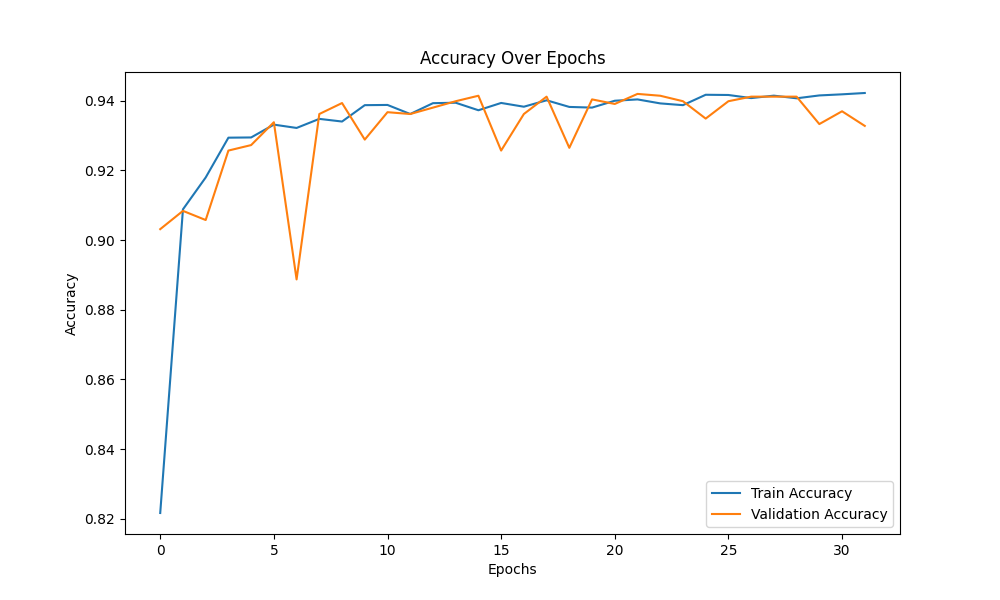
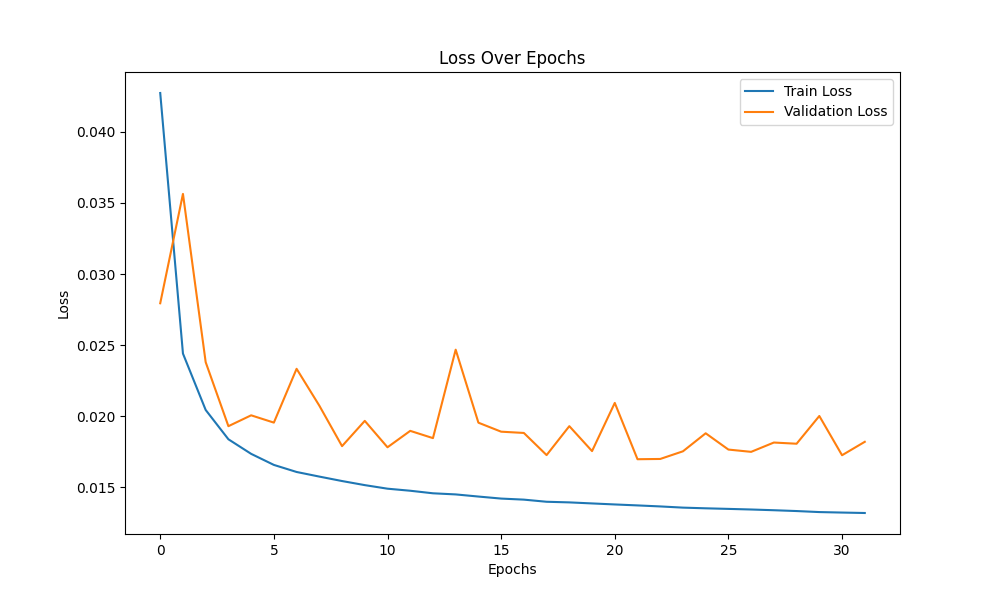

# Air Pollution Forecasting Project

## Table of Contents

- [Project Overview](#project-overview)
- [Project Purpose](#project-purpose)
- [Getting Started](#getting-started)
  - [Prerequisites](#prerequisites)
  - [Installation](#installation)
- [Data Download](#data-download)
- [Data Preparation](#data-preparation)
- [Model Training](#model-training)
- [Model Evaluation](#model-evaluation)
- [Training Results](#training-results)

## Project Overview

Welcome to the Air Pollution Forecasting project, where we harness the power of machine learning to predict air pollution levels. This project focuses on building a predictive model that utilizes historical data to forecast air pollution, a critical aspect of public health and environmental monitoring.

## Project Purpose

The purpose of this project is to develop a robust machine learning model capable of predicting air pollution levels. Given the significant health and environmental impacts of air pollution, accurate forecasting plays a pivotal role in mitigating these effects. The model is designed for real-time monitoring, early warnings, and aiding policy decisions.

## Getting Started

Let's dive into the project. Follow these steps to get started:

### Prerequisites

Before we begin, ensure you have the following prerequisites in place:

- Python (version 3.9 or later)
- Virtual environment (optional but recommended)
- `make` utility (optional but recommended)

If you plan to use GPU acceleration, make sure you've installed the CUDA toolkit and the corresponding cuDNN file for your platform following Nvidia's instructions.

### Installation

1. Clone the repository to your local machine:

   ```bash
   git clone git@github.com:MykytaKyt/air-pollution-forecasting.git
   cd air-pollution-forecasting
   ```

2. Create a virtual environment (optional but recommended):

   ```bash
   python -m venv venv
   source venv/bin/activate  # On Windows: venv\Scripts\activate
   ```

3. Install the required packages from the `requirements.txt` file:

   ```bash
   pip install -r requirements.txt
   ```

## Data Download

To begin, download the dataset from [Google Drive](https://drive.google.com/file/d/1JoIQPZCGRcvvtUiVs20g_wA8JVH312nC/view?usp=drive_link) and extract the contents to the project's root folder. You can also access more recent data from the [Save Eco Bot Station 15705](https://www.saveecobot.com/en/station/15705) website, following their provided instructions.

You can download the trained model from this link: [Trained Model](https://drive.google.com/file/d/1NWVSwvM3shwlCTTtq3E5R6kvtkHkZnZv/view?usp=drive_link)

## Data Preparation

To preprocess the data for training and evaluation, use the following command:

```bash
make process
```

This command runs the `process.py` script, which handles data preprocessing and prepares the dataset for training the machine learning model.

## Model Training

Train the machine learning model for air pollution forecasting using the `train.py` script. This script handles data preprocessing, model training, and saving the trained model. Customize training options such as epochs, batch size, and early stopping patience as needed for your specific use case.

```bash
make train
```

## Model Evaluation

Evaluate the performance of the trained model using the `eval.py` script. This script loads the trained model and performs evaluation on a test dataset.

```bash
make eval
```

The evaluation script provides insights into the model's accuracy and its ability to forecast air pollution levels. It reports metrics such as Mean Absolute Error (MAE) and accuracy to help assess the model's effectiveness.

## Training Results

### Performance Metrics

- **Final Training Accuracy:** 89.77%
- **Final Test Accuracy:** 88.95%
- **Final Training Loss:** 0.0132
- **Final Test Loss:** 0.0191

### Training Accuracy



The training accuracy plot demonstrates the model's learning progress over epochs, showing a steady increase in accuracy.

### Training Loss



The training loss plot depicts the model's loss reduction during training, indicating effective error minimization.

## Summary

In summary, this project successfully develops an air pollution forecasting model:

- The training accuracy consistently improves, demonstrating the model's learning ability.
- The training loss consistently decreases, indicating effective optimization.
- These results affirm the successful training of our air pollution forecasting model, which holds promise for public health and environmental applications.